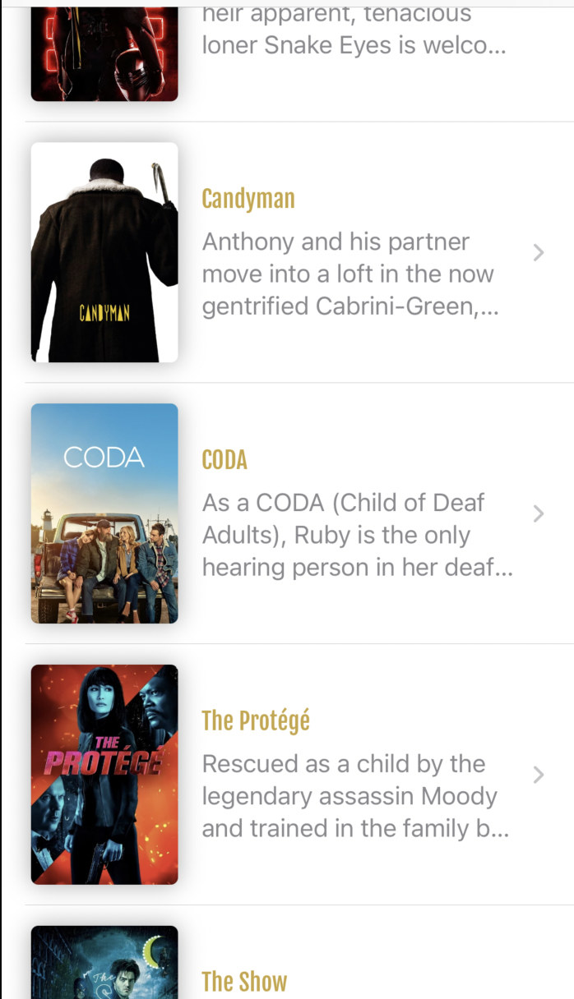
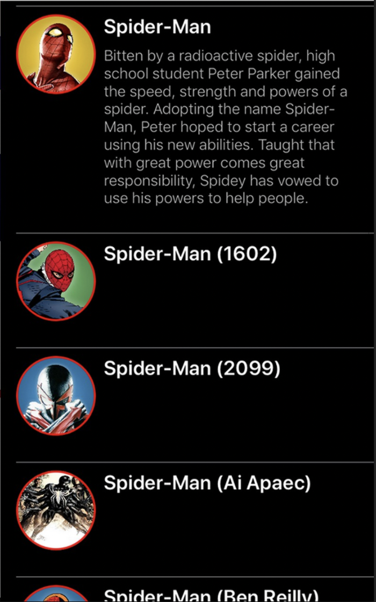

# Лабораторная 1. Сверстать экран со списком элементов

Необходимо сверстать экран на статичных данных со списком элементов.

В реализации списка рекомендуется использовать [ListView](https://api.flutter.dev/flutter/widgets/ListView-class.html) и [ListTile](https://api.flutter.dev/flutter/material/ListTile-class.html)

Базовые требования:

- Ячейка таблицы должна содержать картинку, заголовок и текст описания
- Ячейка должна динамически изменяться по высоте относительно контента
- Лабораторная работа должна быть залита на github

Любые дополнения на ваше усмотрение

## Примеры результата верстки:

 
 

## Полезные материалы:

- [пример создания списка](https://flutter.dev/docs/cookbook/lists/basic-list)
