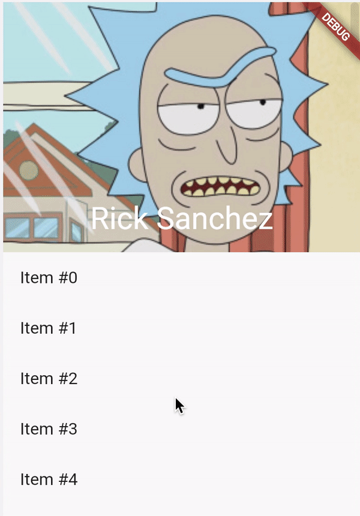

# Лабораторная 3. Экран элемента

Необходимо реализовать по клику на элемент списка открытие экрана его подробной информации (данные статичные).

## Базовые требования:

- Header экрана должен содержать картинку, заголовок, под хедером должно быть описание элемента

- При скролле Header должен уменьшаться, оставляя внутри только текст
  
- Status bar должен быть светлый и у фотографии сверху должна быть небольшая тень, чтобы светлая фотография не перекрывала status bar
- Лабораторная работа должна быть залита на github

 

## Полезные материалы:

- [SliverAppBar](https://api.flutter.dev/flutter/material/SliverAppBar-class.html)
- [Пример](https://flutter.dev/docs/cookbook/lists/floating-app-bar) добавления SliverAppBar в список
