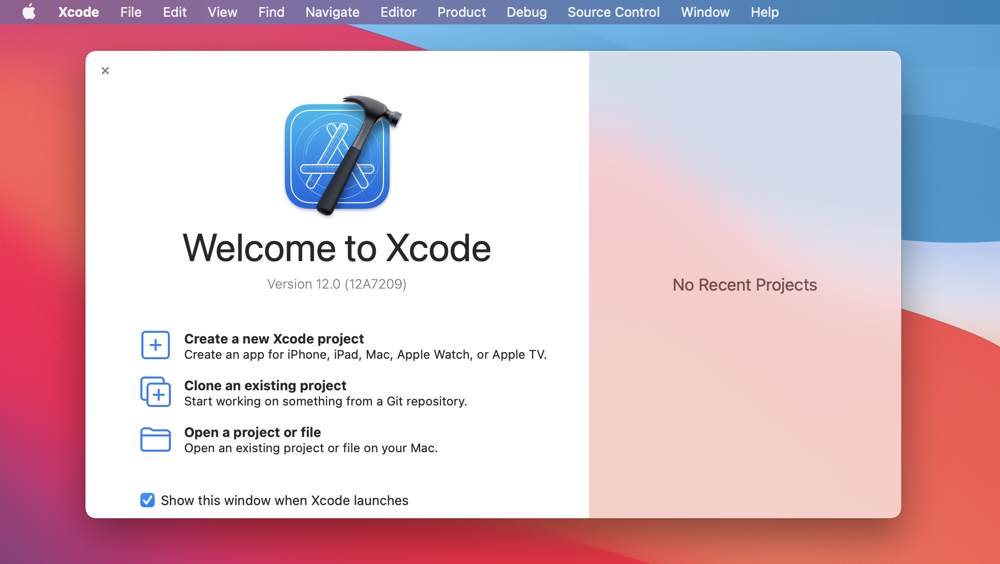
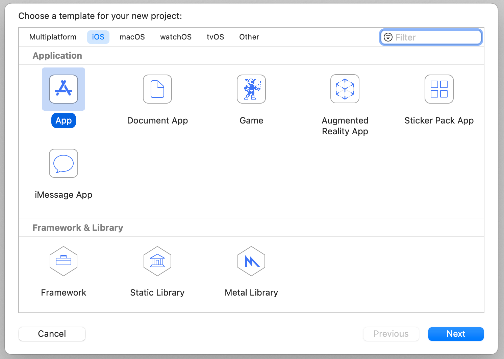
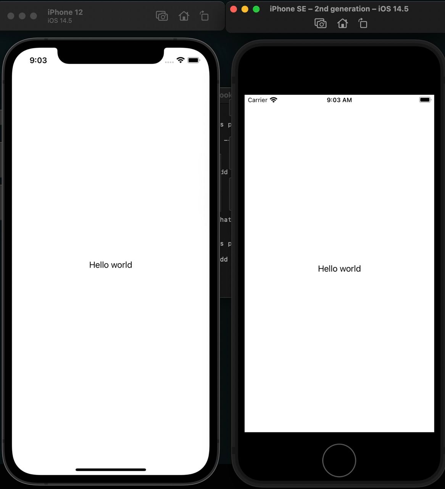

# Настройка окружения. Hello world 

## Подготовка окружения
1. Загрузить Xcode на ваше устройство
https://apps.apple.com/ru/app/xcode/id497799835?mt=12
2. Авторизоваться и подтвердить, что согласны с условиями Apple для разработки под их экосистему.
https://developer.apple.com/ (Для авторизации нужен AppleID предварительно создать, если его нет)
3. После открытия среды разработки Xcode вы увидите окно представленное ниже, создайте новый Xcode проект.
 
4. Выберете iOS application
 
5. Добавление developer account в Xcode
    1. ```Xcode → Preferences ``` 
перейдите на панель Account pane
    2. Нажмите кнопку + в нижнем левом углу и выберите Apple ID
    3. Войдите в систему, указав свой адрес электронной почты Apple ID и пароль 
## Hello world 
Необходимо добавить экран с UILabel по центру на котором написано ```Hello world```

Текст должен быть по центру на экране любого размера 
