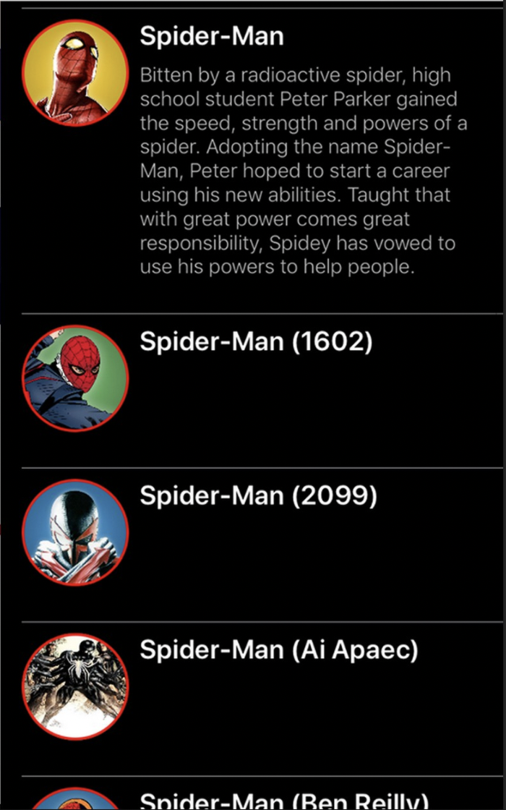

# Лабораторная 2. Сверстать экрана со списком элементов

Необходимо сверстать экран на мокнутых данных со списком элементов.

Экран нужно реализовать с помощью UIKit.
В реализации списка вам поможет ```UITableView```
https://developer.apple.com/documentation/uikit/uitableview

Базовые требования:
- Ячейка таблицы должна содержать картинку, заголовок и текст описания
- Ячейка должна динамически изменяться по высоте относительно контента

Любые дополнения на ваше усмотрение 
## Примеры:

