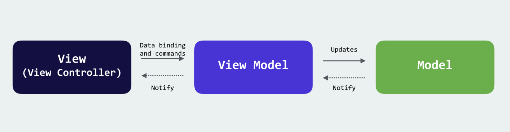

# Лабораторная 5. Организовать архитектуру
Лабораторная работа является продолжением лабораторных работ: [1,](./Lab01.md) [2,](./Lab02.md) [3,](./Lab03.md) [4](./Lab04.md)
 
 
Необходимо привести имеющийся код "в порядок" и организовать архитектуру

* TODO добавить картинку с архитектурой iOS 

  

## Критерии приемки:

- Необходимо вынести повторяющиеся части интерфейса в отдельные виджеты и переиспользовать
- Каждый виджет/экран должен находится в отдельном файле с одноименным названием
- Для каждой сущности данных должен быть создан свой класс или структуру(https://developer.apple.com/documentation/swift/choosing_between_structures_and_classes), в том числе определяющий декодирование(https://developer.apple.com/documentation/swift/decodable), из JSON в entity model
- Необходимо выделить отдельный класс для работы с _api_
- [Необходимо организовать архитектуру MV*](https://habr.com/ru/company/croc/blog/549590/), рекомендуется использовать MVVM.
- Лабораторная работа должна быть залита на **github**

 

## Полезные материалы:

- Для знакомства с MV* архитектурами рекомендуется прочитать статьи
https://habr.com/ru/company/badoo/blog/281162/
https://medium.com/@dev.omartarek/mvp-vs-mvvm-in-ios-using-swift-337884d4fc6fjson#serializing-json-inside-model-classes

